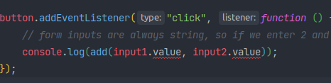

<!-- START doctoc generated TOC please keep comment here to allow auto update -->
<!-- DON'T EDIT THIS SECTION, INSTEAD RE-RUN doctoc TO UPDATE -->
**Table of Contents**

- [Notes on various typescript courses on youtube](#notes-on-various-typescript-courses-on-youtube)
  - [What is typescript](#what-is-typescript)
  - [Why typescript?](#why-typescript)
  - [Installation](#installation)
  - [Compilation](#compilation)
    - [Normal compilation](#normal-compilation)
    - [With file watches](#with-file-watches)
  - [Type inference](#type-inference)
  - [Setting defaults](#setting-defaults)
  - [Code examples say more than 1000 words](#code-examples-say-more-than-1000-words)
  - [Including typescript with react](#including-typescript-with-react)
  - [ZOD for type validation and inferring types](#zod-for-type-validation-and-inferring-types)
    - [Basics: primitive types, validation and type inference](#basics-primitive-types-validation-and-type-inference)
    - [Fine tuning validation of existing zod types](#fine-tuning-validation-of-existing-zod-types)
    - [Object validation](#object-validation)
    - [Arrays](#arrays)
    - [Tuples](#tuples)
    - [Unions](#unions)
    - [Records](#records)
    - [Maps](#maps)
    - [Sets](#sets)
    - [Promises](#promises)
    - [Advanced / custom validation / types](#advanced--custom-validation--types)
    - [Error handling](#error-handling)

<!-- END doctoc generated TOC please keep comment here to allow auto update -->

# Notes on various typescript courses on youtube 

https://www.youtube.com/watch?v=BwuLxPH8IDs
https://www.youtube.com/watch?v=BCg4U1FzODs

## What is typescript

- JavaScript superset
- Adds error-checked static types to javascript, so we don't have to do validation of arguments during runtime anymore
- Types are completely optional
- Adds new features and most ES6 and ES7 features
- Types from 3rd party libraries can be added with type definitions
- Must be transpiled (can't be executed by node / browsers)

Typescript adds...

- types
- next gen javascript features like with babel
- non-JS features like interfaces and generics
- meta programming features like decorators
- rich configuration options
- better tooling in IDEs

Cons: 

- more code to write
- more to learn
- compilation required
- not true static typing (as it just compiles down to regular JS)

## Why typescript?

File: using-js.js:

    const button = document.querySelector("button");
    const input1 = document.querySelector("#num1");
    const input2 = document.querySelector("#num2");
    
    function add(num1, num2) {
        return num1 + num2;
    }
    
    button.addEventListener("click", function () {
        // form inputs are always string, so if we enter 2 and 3 in input 1 and input 2...
        console.log(add(input1.value, input2.value));
    });


We could do `typeof` checks in JS, but we don't need to in typescript.

## Installation

- Install npm
- Install typescript (optionally globally): `sudo npm install -g typescript`

The typescript compiler is now accessible with the `tsc` command.

## Compilation

Now, when we create a .ts file, our IDE will spot possible errors with the code above as it might be that the object doesn't have a type property (and we'll also not be able to compile it with `tsc`):



### Normal compilation

We can convert the JS to typescrypt:

File: using-ts.ts

    const button = document.querySelector("button")!;
    const input1 = document.querySelector("#num1")! as HTMLInputElement;
    const input2 = document.querySelector("#num2")! as HTMLInputElement;
    
    function add(num1: number, num2: number) {
        return num1 + num2;
    }
    
    button.addEventListener("click", function () {
        // form inputs are always string, so if we enter 2 and 3 in input 1 and input 2...
        // the plus just converts it to a number (not typescript specific)
        console.log(add(+input1.value, +input2.value));
    });

- The `!` indicates that the result of the expression will never be null
- The `as HTMLInputElement` indicates the type of the expression
- Argument types are indicated with `var: type`

Now we can compile it to plain js using `tsc using-ts.ts` which produces a file `using-ts.js`.

File: using-ts.js

    var button = document.querySelector("button");
    var input1 = document.querySelector("#num1");
    var input2 = document.querySelector("#num2");
    function add(num1, num2) {
        return num1 + num2;
    }
    button.addEventListener("click", function () {
        console.log(add(+input1.value, +input2.value));
    });

The result compiles down to ES5 (see `var` above) and is (almost) identical to the original javascript file, but we caught and fixed (with the `+`) the error in the IDE / at compile time because of TS type checking!

### With file watches

Automatic compilation upon file change can be done with the `-w` (or `--watch`) option.

For all options, check `tsc --help`

## Type inference

Types can be declared explicitly, e.g. `let id: number = 5;` or can be inferred automatically by typescript:

    let id: number = 5;
    let id2 = 5; // type is inferred
    id = '5'; // error!
    id = '5'; // also error!

## Setting defaults

The default JS version target is ES5 (no `const`/`let` among others).

We can set the target JS version to be compiled to and other options by cretint a `tsconfig.json` file using `tsc --init`. There you can change the "target" e.g. to "es6".

Note that the configuration file in the current directory is not applied when file:

`tsc -p . # the current directory`

Other notable options are rootDir, outDir, sourceMap, allowJs.

When we are in a (root) directory of a project and just call `tsc`, the tsconfig file is used automatically.

## Code examples say more than 1000 words

```typescript
let id = 5; // inferred type
let company: string = 'hey';
let published: boolean = true;
let x: any = 'hello';
// assigment after initialization
let age: number;
age = 30; 

// array, c-like typing
let ids: number[] = [1,2,3,4,5];
//ids.push('hey'); // error, not a number

// allow any type
let arr: any[] = [1, 'hey', true];

// Tuple
let person: [number, string, boolean] = [1, "hey", true];
//person = [1, "hey", 100]; // error, 100 is not a boolean

// Tuple array
let employee: [number, string][];

employee = [
    [1, "hey"],
    [2, "ho"],
]

// Unions (set of allowed types)
let pid: string | number = 22;
pid = "hey"; // ok

// Enum
// These get values assigned automatically (UP=0, DOWN=1, LEFT=2, ...)
enum Direction1 {
    UP, DOWN, LEFT,RIGHT
}

console.log(Direction1.RIGHT) // 3

// Enum with defined values
enum Direction2 {
    UPS = 'up',
    DOWN = 'down',
}

// Type assertion
let cid: any = 1;
let customerId1 = <number>cid; // asserts that cid is a number
let customerId2 = cid as number; // same

// Functions
// arguments are implicitely "any" if not defined
// return values are added just like in php (function x(...): [type])
function addNum(x: number, y: number): number {
    return x + y;
}

// void type exists for functions
function log(message: string | number): void {
    console.log(message);
}

// Objects inline type
const user: {
    id: number,
    name: string
} = {
    id: 1,
    name: 'john'
}

// Defining an object type
type User = {
    id: number,
    name: string
}

const user2: User = {
    id: 1,
    name: 'john'
}

// Types can be a union of other types (interfaces can't):
type Point = number | string;
const p1: Point = 1;

// Interfaces
// the readonly and ? modifiers work for type definitions too
interface UserInterface {
    readonly id: number, // readonly modifier does what it says
    name: string,
    age?: number // ? indicates an optional property
}

const user3: UserInterface = {
    id: 1,
    name: 'john'
}

// There are also function interfaces
interface MathFunc {
    (x: number, y: number): number
}

const add: MathFunc = (x:number, y:number): number => x + y;
const sub: MathFunc = (x:number, y:number): number => x - y;

// log(true); // error
// let x = log('hey'); // error because of void return type

// Classes
// Most of this is like vanilla ES6+ JS
class Person {
    private _id: number;
    name: string; // public is default

    constructor(id: number, name: string) {
        this._id = id;
        this.name = name;
    }

    get id(): number { // can now be accessed with object.id
        return this._id;
    }
    
    register(): string {
        return `${this.name} is now registered`;
    }
}

const brad = new Person(1, 'Brad');
console.log(brad.register());

// Class interfaces 
interface PersonInterface {
    readonly id: number;
    name: string;
    age?: number; 
    
    register(): string;
}

class OtherPerson implements PersonInterface {
    readonly id: number;
    name: string;
    age?: number;
    
    constructor(id: number, name: string) {
        this.id = id;
        this.name = name;
    }

    register(): string {
        return `${this.name} is now registered`;
    }
}

// Inheritance / subclassing
class OPwithPosition extends OtherPerson {
    position: string;
    
    constructor(id: number, name: string, position:string) {
        super(id, name);
        this.position = position;
    }
}

// Generics
// lets you give a placeholder for a type that you can fill on call or instantiation
function getArray<T>(items: T[]): T[] { 
    return new Array().concat(items);
}

let numArr = getArray<number>([1,2,3,4]);
let strArr = getArray<string>(['a', 'b', 'joe']);

numArr.push(5); // fine
//numArr.push('hello'); // error
strArr.push('hello'); // fine

// We can also define state from the shape of an existing object!
const initialState = {
first: "Jack",
last: "Jackson"
};

type UserState = typeof initialState;
```


## Including typescript with react

`npx create-react-app . --template typescript`

No more proptypes necessary!

    import React from 'react';
    
    export type HeaderProps = {
        title: string;
        color?: string;
    }
    
    const Header = ({title, color}: HeaderProps) => {
        return (<header>
            <h1 style={{color: color ? color : 'blue'}}>{title}</h1>
        </header>);
    }
    
    export default Header;

## ZOD for type validation and inferring types

Follow along of "Learn Zod in 30 Minutes" by web dev simplified: https://www.youtube.com/watch?v=L6BE-U3oy80&t=314s

Small validation library with good typescript support.

Full documentation with code examples: [github](https://github.com/colinhacks/zod) or [zod.dev](https://zod.dev/) 

### Basics: primitive types, validation and type inference

```typescript
import {z} from 'zod';

// define validation schema with various primitive types
const UserSchema = z.object({
    // all properties are required by default
    username: z.string(),
    // unless "optional" is specified
    age: z.number().optional(),
    birthDate: z.date().optional(),
    isProgrammer: z.boolean().optional(),

    alwaysUndef: z.undefined(),
    alwaysNull: z.null().optional(), // optional added just for test
    nullOrUndef: z.void(),
    everything: z.any(), // same as in TS
    unknown: z.unknown(), // same as in TS
    // as per video explanation, validation fails if "never" key is present in the validated object
    // but it throws an error when the variable is not present = undefined?
    // never: z.never()
});


const user = {username: "pkro"}
const invalidUser = {username: 123}

// validate - returns the object if it passes
console.log(UserSchema.parse(user));

// or throws ZodError exception if not
/*ZodError: [
  {
    "code": "invalid_type",
    "expected": "string",
    "received": "number",
    "path": [
      "username"
    ],
    "message": "Expected string, received number"
  }
]*/
try {
    console.log(UserSchema.parse(invalidUser));
} catch (e) {
    console.log(e);
}

// safeParse doesn't throw an exception but returns an error object on fail:
// { success: false, error: ZodError }
console.log(UserSchema.safeParse(invalidUser));

// on success, returns NOT the object itself but an object with the object
// stored in "data":
/*{
    "success": true,
    "data": {
        "username": "pkro"
    }
}*/
console.log(UserSchema.safeParse(user));

// infer typescript type from zod schema so it doesn't have to be defined twice:
type User = z.infer<typeof UserSchema>;
```

### Fine tuning validation of existing zod types

```typescript
const UserSchema = z.object({
    username: z.string().min(3),
    age: z.number().gt(12),
    birthDate: z.date().min(new Date(1900, 3,1)),
    //isProgrammer: z.boolean().nullable(), // like typescript " | null"
    // isProgrammer: z.boolean().nullish(), // like " | null | undefined"

    // defining default values that are added to the object returned by z.parse / z.safeParse
    isProgrammer: z.boolean().default(true),
    // function can be passed to default as well
    //derivedValue: z.number().default(()=>Math.random())

    // literal means only one value, so it MUST be the value specified
    literal: z.literal('some value').optional(),

    hobbies: z.enum(['sports', 'guitar']).optional(), // same as TS "sports" | "guitar"

    // predefined arrays must be defined "as const" to be used as a parameter for z.enum(),
    // e.g. const vals = ["sports", "guitar"] as const


    // z.nativeEnum takes a TS enum type as parameter
});

// note that the inferred type DOESN'T take specifics of min string length,
// default values etc. into account as that is out of typescript's scope
// properties with default values defined in schema are ALWAYS required in
// the derived type!
type User = z.infer<typeof UserSchema>;

// if "isProgrammer" is omitted, you still get a typescript error despite the default value in the schema
const user: User = {username: "pkro", age: 99, birthDate: new Date(1920, 3,1), isProgrammer: true}
```

### Object validation

```typescript
const hobbies = ['sports', 'guitar'] as const
const UserSchema = z.object({
    username: z.string(),
    age: z.number(),
    birthDate: z.date(),
    isProgrammer: z.boolean(),
    hobbies: z.enum(hobbies),
});

console.log(UserSchema.partial()); // like TS Partial<Type>, makes all properties optional

// make all properties optional:
const partialUserSchema = UserSchema.partial();
type partialUser = z.infer<typeof partialUserSchema>

// schema.deepPartial makes everything including nested objects partial

// pick properties from validation / type
const onlyUserNameSchema = UserSchema.pick({username: true});
type onlyUserName = z.infer<typeof onlyUserNameSchema> // type: { username: string }

// remove properties:
const withoutUsernameSchema = UserSchema.omit({username: true});

// add properties
const withNumLegs = UserSchema.extend({numLegs: z.number()});

// merge schemas
const newSchema = UserSchema.merge(z.object({last_name: z.string()}));
```

Allow / forbid keys not defined in schema:

```typescript
const UserSchema = z.object({
    username: z.string(),
});

// if an object contains more properties than defined in the schema, it removes them in the
// returned object!
console.log(UserSchema.parse({username: "Joe", nonExistantProp: "Jill"})); // { username: "Joe" }

// unless passtrhough is used:
const returnUnspecifiedKeysSchema = UserSchema.passthrough();

// throw error if nonexistant property exists:
const onlyDefinedValuesSchema = UserSchema.strict();
```

### Arrays

```typescript
const UserSchema = z.object({
    username: z.string(),
    // specific length, min or max can be defined too
    friends: z.array(z.string()).nonempty()
});
```

### Tuples

```typescript
const UserSchema = z.object({
    username: z.string(),
    // tuple / array with 3 numbers
    coords: z.tuple([z.number(), z.number(), z.number()]),
    // tuple with at least string + number values and unlimited more of type number
    employee: z.tuple([z.string(), z.number()]).rest(z.number())
});
```

### Unions

```typescript
const UserSchema = z.object({
    id: z.union([z.string(), z.number()]), // same as TS string | number
    id2: z.string().or(z.number()), // same

    // discriminated union
    // "The constructor of the discriminated union schema.
    // Its behaviour is very similar to that of the normal z.union() constructor.
    // However, it only allows a union of objects, all of which need to share
    // a discriminator property. This property must have a different value for each object in the union."
    result: z.discriminatedUnion("status", [
        z.object({status: z.literal("success"), data: z.string()}),
        z.object({status: z.literal("failed"), data: z.instanceof(Error)}),
    ])
});
```

### Records

```typescript
const UserMap = z.record(z.string()); // string is for the value, not the key!
const UserMap2 = z.record(z.string(), z.number()); // key must be string, value must be number

const user = {"id": "123", "name": "joe"}

console.log(UserMap.safeParse(user));
```

### Maps

```typescript
const UserMap = z.map(z.string(), z.object({name: z.string()})); // key must be string, value must be number

const users = new Map([
    ["id-joe", {name: "joe123"}],
    ["id-jill", {name: "jill234"}]
]);

console.log(UserMap.safeParse(users));
```

### Sets

```typescript
// also supports min, max etc. just like arrays
const numberSet = z.set(z.number());

const numbers = new Set([1,1,2,3]); // 1,2,3

console.log(numberSet.safeParse(numbers));
```

### Promises

```typescript
// validate that it's a promise AND the value type the promise must resolve to
const PromiseSchema = z.promise(z.string()); 

const p = Promise.resolve("abs")

console.log(PromiseSchema.safeParse(p));
```

### Advanced / custom validation / types

```typescript
const brandEmail = z.string()
    .email()
    .refine(
    val=>val.endsWith("@example.com"),
    { message: "Email must be from example.com domain!" }
)

// there also exists ".superRefine" which gives more low level access to validation
```

### Error handling

Zod provides a library to simplify the errors returned from parse which can be separately installed: `npm i zod-validation-error`.

```typescript
const UserSchema = z.object({
    // you can add own error messages to all validations
    name: z.string().min(3, {message: "Name must be at least 3 characters"})
})

const user = {name: 99};

const results = UserSchema.safeParse(user);

if (!results.success) {
    console.log(fromZodError(results.error));
}
```
